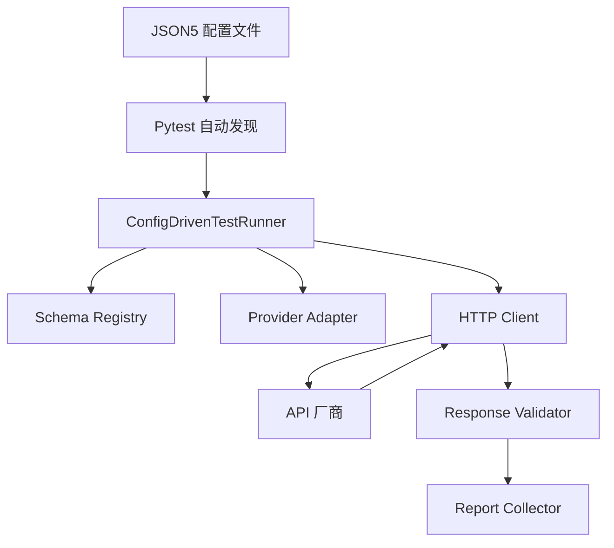

# 配置驱动测试指南 (Configuration-Driven Testing Guide)

## 概述

本项目已从手写 Python 测试代码全面迁移至**配置驱动 (Configuration-Driven)** 架构。测试逻辑（如何请求、如何验证、如何报告）已固化在执行引擎中，开发者只需通过 JSON5 配置文件即可定义新的测试套件和用例。

---

## 核心组件流程



---

## 配置文件规范 (.json5)

配置文件位于 `tests/testcases/` 目录下。

### 顶级字段说明

| 字段 | 类型 | 说明 |
| :--- | :--- | :--- |
| `suite_name` | string | 测试套件名称（如 "OpenAI Chat"） |
| `provider` | string | 厂商标识符（openai, gemini, anthropic, xai） |
| `endpoint` | string | API 路径（如 "/v1/chat/completions"） |
| `method` | string | HTTP 方法（如 "POST"） |
| `base_params` | object | 所有测试用例共享的基础参数（模型名等） |
| `param_wrapper`| string | (可选) 参数包装键，如 Gemini 的 `generationConfig` |
| `schemas` | object | 校验配置。`response` 字段需填入注册表中的 Key |
| `tests` | array | 具体测试用例数组 |

### 测试用例字段 (`tests` 数组)

- `name`: 用例名称。
- `description`: 详述测试目的。
- `params`: 本用例特有的参数。会自动与 `base_params` 合并。
- `parameterize`: (可选) 动态生成子用例。如 `{"model": ["gpt-4o", "o1-mini"]}`。
- `files`: (可选) 上传文件。格式为 `{"字段名": "文件相对于根目录的路径"}`。
- `stream`: (可选) 设为 `true` 以启动流式解析校验。
- `unsupported_param`: (可选) 指定一个参数路径作为统计不支持项的特征键。
- `no_wrapper`: (可选) 设为 `true` 以在该用例中跳过 `param_wrapper` 的包装。

---

## 模式示例 (Test Patterns)

### 1. 基础测试 (Baseline)
```javascript
{
  name: "test_baseline",
  params: {} // 仅使用 base_params
}
```

### 2. 参数化测试 (Parameterize)
一次性对多个模型或选项进行交叉测试：
```javascript
{
  name: "test_model_variants",
  parameterize: {
    model: ["gpt-4o-mini", "o1-preview", "gpt-4o"]
  },
  params: { model: "$model" } // 使用 $ 符号引用变量
}
```

### 3. 文件上传测试 (Multipart)
```javascript
{
  name: "test_transcription",
  files: {
    file: "test_assets/audio/hello.mp3"
  },
  params: { model: "whisper-1" }
}
```

---

## 如何添加新测试用例 (四步走)

### 第一步：检查或添加 Schema
在 `llm_spec/validation/schemas/` 目录下确保有对应的 Pydantic 模型。

### 第二步：注册 Schema
在 `tests/runners/schema_registry.py` 中导入并注册该模型：
```python
from llm_spec.validation.schemas.openai.audio import AudioTranscriptionResponse
_REGISTRY["openai.AudioTranscription"] = AudioTranscriptionResponse
```

### 第三步：创建 JSON5 配置文件
在 `tests/testcases/` 下的对应厂商文件夹中（如 `openai/`）创建 `.json5` 文件。

### 第四步：运行测试
```bash
# 运行指定厂商的配置测试
uv run pytest tests/test_from_config.py -k "openai"

# 结合日志查看详情
uv run pytest tests/test_from_config.py -v --log-cli-level=INFO
```

---

## 注意事项

1. **绝对路径 vs 相对路径**：JSON5 中的文件路径应相对于项目根目录。
2. **深度合并**：`params` 会递归地合并到 `base_params` 中，允许覆盖或添加子字段。
3. **不支持项记录**：如果某个参数确定不支持，请务必填写 `unsupported_param` 字段，这将作为生成“参数支持表格”的核心依据。
