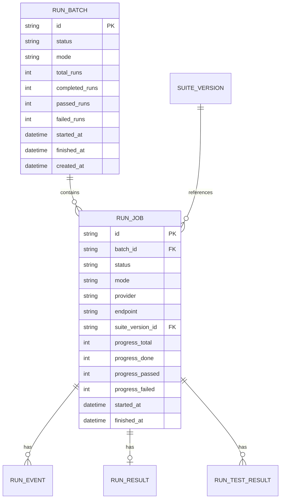
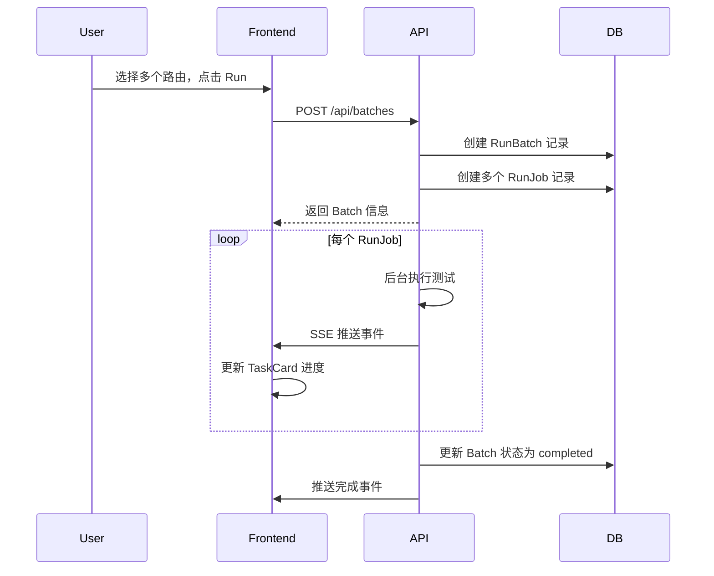

# Testing 页面 Task 卡片功能设计方案

## 需求概述

将当前"一个路由一个卡片"的展示方式改为"Task 卡片"模式：
- 一次测试任务（选中多个路由点击 Run）作为一个 **Task**（批次）
- Task 卡片顶部显示任务基本信息（时间、总体进度等）
- Task 卡片可展开/折叠，内部展示每个路由的测试进度
- 支持查看历史 Task 记录
- 支持删除 Task 记录

## 架构设计



## 数据模型变更

### 1. 新增 RunBatch 模型

**文件**: `llm_spec/web/models/run.py`

```python
class RunBatch(Base):
    """Run batch model - represents a test task containing multiple runs."""

    __tablename__ = "run_batch"

    id: Mapped[str] = mapped_column(String(36), primary_key=True, default=new_id)
    status: Mapped[str] = mapped_column(String(16), nullable=False, default="running", index=True)
    mode: Mapped[str] = mapped_column(String(16), nullable=False, default="real")
    total_runs: Mapped[int] = mapped_column(Integer, nullable=False, default=0)
    completed_runs: Mapped[int] = mapped_column(Integer, nullable=False, default=0)
    passed_runs: Mapped[int] = mapped_column(Integer, nullable=False, default=0)
    failed_runs: Mapped[int] = mapped_column(Integer, nullable=False, default=0)
    started_at: Mapped[datetime | None] = mapped_column(DateTime(timezone=True), nullable=True)
    finished_at: Mapped[datetime | None] = mapped_column(DateTime(timezone=True), nullable=True)
    created_at: Mapped[datetime] = mapped_column(DateTime(timezone=True), default=now_utc)
```

### 2. 修改 RunJob 模型

添加 `batch_id` 外键字段：

```python
batch_id: Mapped[str | None] = mapped_column(
    String(36),
    ForeignKey("run_batch.id", ondelete="CASCADE"),
    nullable=True,
    index=True,
)
```

### 3. 数据库迁移 SQL

```sql
-- 创建 run_batch 表
create table if not exists run_batch (
    id varchar(36) primary key,
    status varchar(16) not null default 'running',
    mode varchar(16) not null default 'real',
    total_runs integer not null default 0,
    completed_runs integer not null default 0,
    passed_runs integer not null default 0,
    failed_runs integer not null default 0,
    started_at timestamptz null,
    finished_at timestamptz null,
    created_at timestamptz not null default now()
);

create index if not exists ix_run_batch_status on run_batch(status);
create index if not exists ix_run_batch_created_at on run_batch(created_at desc);

-- 为 run_job 添加 batch_id 字段
alter table run_job add column batch_id varchar(36) references run_batch(id) on delete cascade;
create index if not exists ix_run_job_batch_id on run_job(batch_id);
```

## API 设计

### 新增 API 端点

| 方法 | 路径 | 描述 |
|------|------|------|
| POST | `/api/batches` | 创建新批次（同时创建所有 RunJob） |
| GET | `/api/batches` | 获取批次列表（支持分页） |
| GET | `/api/batches/{batch_id}` | 获取单个批次详情 |
| GET | `/api/batches/{batch_id}/runs` | 获取批次下的所有 RunJob |
| DELETE | `/api/batches/{batch_id}` | 删除批次（级联删除所有 RunJob） |

### API 详细设计

#### POST /api/batches

**请求体**:
```json
{
  "suite_version_ids": ["uuid1", "uuid2"],
  "mode": "real",
  "selected_tests_by_suite": {
    "suite_id_1": ["test1", "test2"]
  }
}
```

**响应**:
```json
{
  "id": "batch_uuid",
  "status": "running",
  "mode": "real",
  "total_runs": 2,
  "completed_runs": 0,
  "passed_runs": 0,
  "failed_runs": 0,
  "started_at": "2024-01-01T00:00:00Z",
  "created_at": "2024-01-01T00:00:00Z",
  "runs": [
    { "id": "run_uuid1", "provider": "openai", "endpoint": "/chat", "status": "running" },
    { "id": "run_uuid2", "provider": "anthropic", "endpoint": "/messages", "status": "queued" }
  ]
}
```

#### GET /api/batches

**查询参数**:
- `status`: 按状态过滤
- `limit`: 返回数量限制，默认 20
- `offset`: 分页偏移

**响应**:
```json
{
  "items": [...],
  "total": 100,
  "limit": 20,
  "offset": 0
}
```

## 前端组件设计

### 组件结构

```
TestingPage.tsx
└── TaskCardList
    └── TaskCard (可折叠)
        ├── TaskCardHeader (任务基本信息)
        │   ├── 状态徽章
        │   ├── 时间信息
        │   ├── 总体进度条
        │   └── 操作按钮 (删除、展开/折叠)
        └── TaskCardContent (展开后显示)
            └── RunCard[] (每个路由的测试卡片)
```

### TaskCard 组件设计

**折叠状态显示**:
- 状态徽章 (Running / Success / Failed)
- 任务创建时间
- 总体进度: X/Y 路由完成
- 总体测试统计: X passed, Y failed
- 展开/折叠按钮
- 删除按钮

**展开状态额外显示**:
- 每个路由的 RunCard (复用现有的 ActiveRunCard / CompletedRunCard)

### 类型定义

**文件**: `frontend/src/types.ts`

```typescript
export type RunBatch = {
  id: string;
  status: string;  // running, completed, cancelled
  mode: string;
  total_runs: number;
  completed_runs: number;
  passed_runs: number;
  failed_runs: number;
  started_at: string | null;
  finished_at: string | null;
  created_at: string;
};

export type RunBatchWithRuns = RunBatch & {
  runs: RunJob[];
};
```

## 实现步骤

### 后端实现

1. **新增 RunBatch 模型** - `llm_spec/web/models/run.py`
2. **新增 RunBatchRepository** - `llm_spec/web/repositories/run_repo.py`
3. **新增 RunBatchService** - `llm_spec/web/services/run_service.py`
4. **新增 API 路由** - `llm_spec/web/api/batches.py`
5. **修改 create_run API** - 支持批量创建
6. **数据库迁移脚本** - `llm_spec/web/migrations/`

### 前端实现

1. **新增类型定义** - `frontend/src/types.ts`
2. **新增 API 函数** - `frontend/src/api.ts`
3. **新增 useBatches hook** - `frontend/src/hooks/useBatches.ts`
4. **新增 TaskCard 组件** - `frontend/src/components/RunCards/TaskCard.tsx`
5. **修改 TestingPage** - 使用 TaskCard 替代现有展示

## 交互流程



## 历史记录功能

- 默认显示最近 20 条 Task 记录
- 支持按状态过滤
- 点击历史 Task 可展开查看详情
- 删除操作：从数据库删除 Batch 及关联的所有 RunJob

## 注意事项

1. **向后兼容**: 现有的 RunJob 可能没有 batch_id，需要处理
2. **级联删除**: 删除 Batch 时级联删除所有关联数据
3. **实时更新**: Batch 的进度需要根据子 RunJob 的状态实时计算
